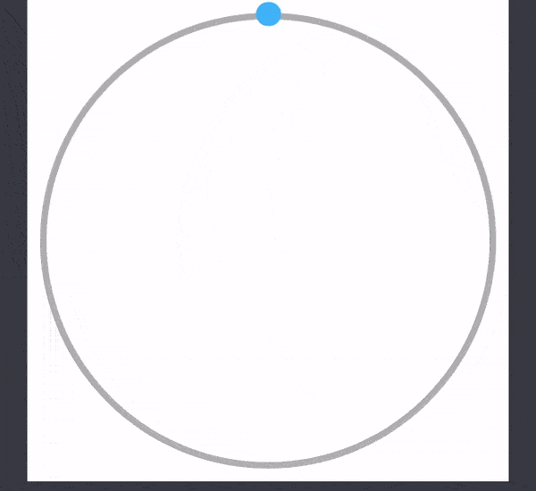
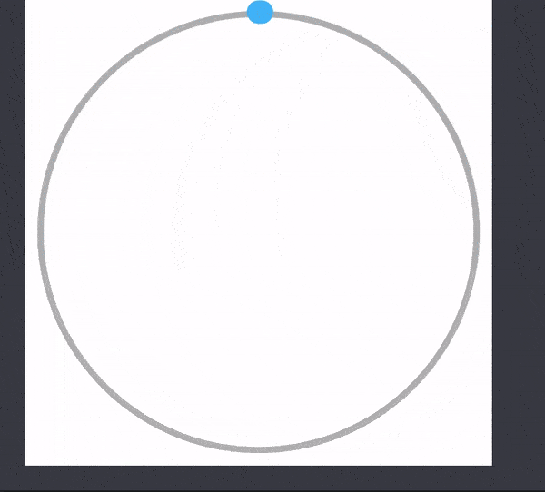

# loader_for_fun

had fun with playground to create a loader like effect with CAShapeLayer and CABasicAnimation

if loop is set to no, you'll get something like this 

if loop is set to true and progression to 100 (%) you might end with something like this

